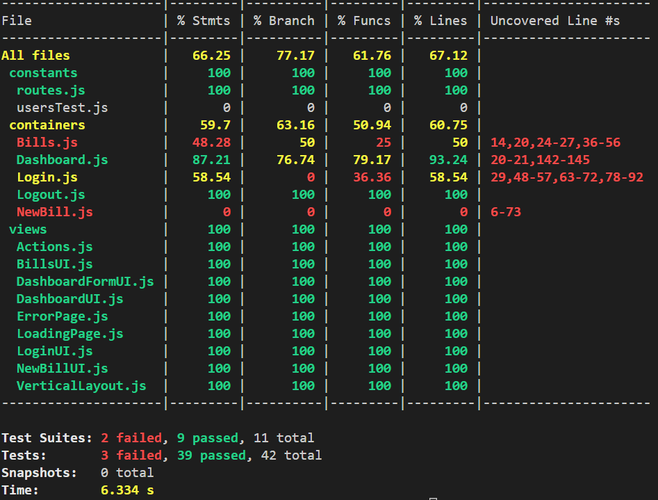
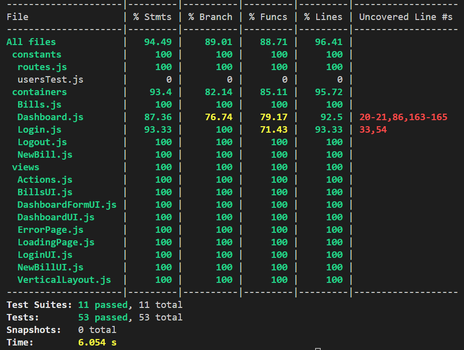
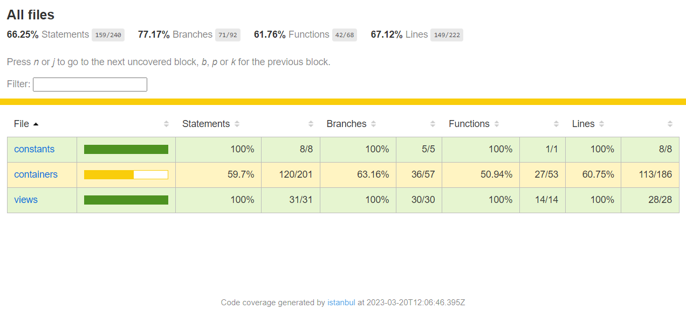
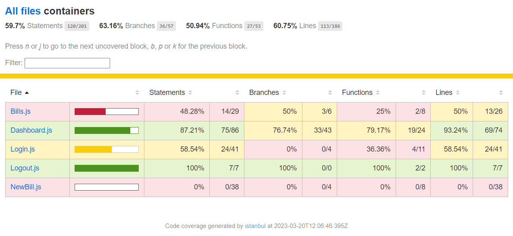
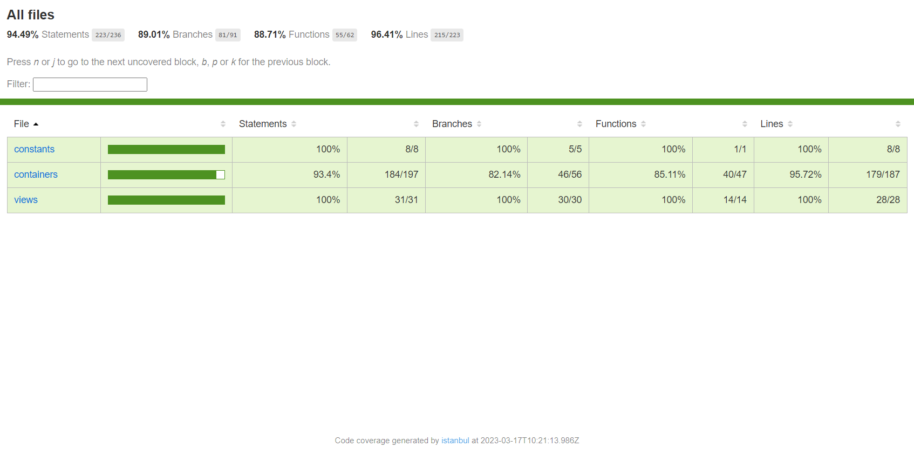
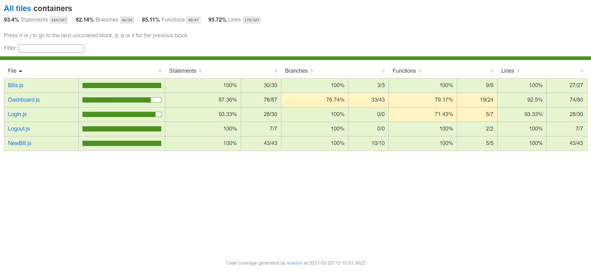

  

<h1 align="center" style="margin-top: 0px;">Projet 9</h1>

## Scénario :
Malheureusement pour Billed, Garance, une collègue de la feature team “note de frais” a quitté l’entreprise avant d’avoir terminé l’application. Dans deux semaines, l’équipe doit montrer la solution qui fonctionne à l’ensemble de l’entreprise. Matthieu, Lead Developer de la feature team a demandé à être aidé pour tenir les délais et vous avez appris hier lors de la réunion d’équipe que c’est vous qui avez été désigné !
## Objectif :
Tout ce que j’attends de toi pour fiabiliser et améliorer le parcours employé est décrit dans [ce document](./readme/assets/others/Billed+-+Description+pratique+des+besoins+-.pdf). Il correspond à la description pratique des besoins pour la mise en place de la fonctionnalité. Il faut que tu le lises très attentivement.
Tu y trouveras notamment le [rapport](./readme/assets/img/bugs_report) avec les bugs identifiés (Kanban Notion) ainsi qu’un [exemple](./readme/assets/others/Billed+-+E2E+parcours+administrateur.pdf) de plan de tests End-to-End. 

Voilà, bon courage pour résoudre ces bugs et mettre en place les tests manquants ! On compte sur toi.

### 🟥 Jest Tests :

#### ■ Before

#### ■ After

### 🟥 Jest Coverage Report :

#### ■ Before

#### ■ After

