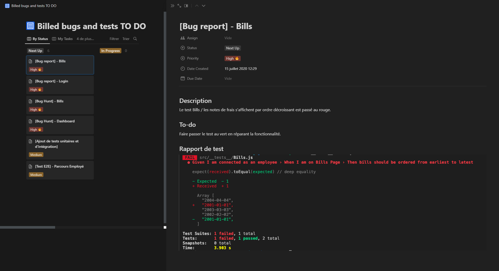
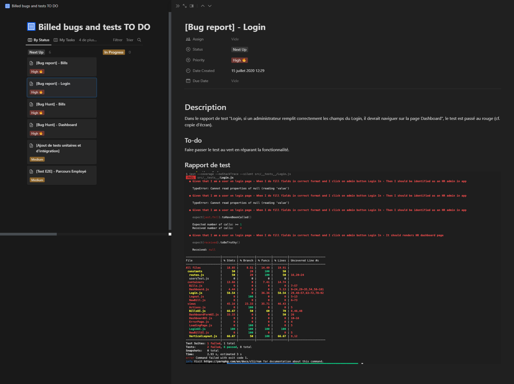
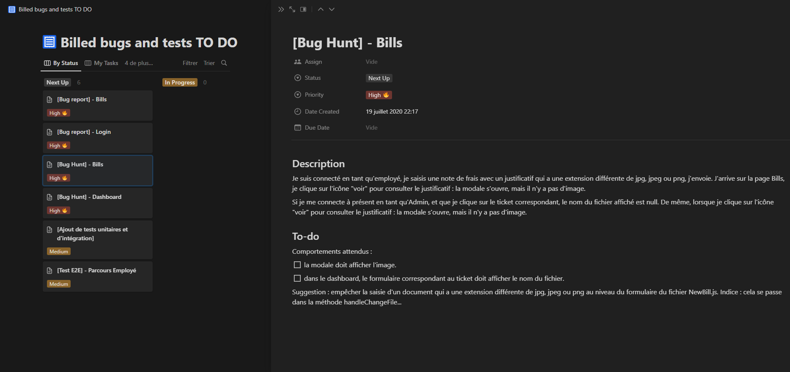

  

<h1 align="center" style="margin-top: 0px;">Billed bugs and tests TO DO</h1>

### 🟥 [Bug report] - Bills :

### 🟥 [Bug report] - Login :

### 🟥 [Bug Hunt] - Bills :

### 🟥 [Bug Hunt] - Dashboard :

### 🟥 [Ajout de tests unitaires et d'intégration] :

### 🟥 [Test E2E] - Parcours Employé :
